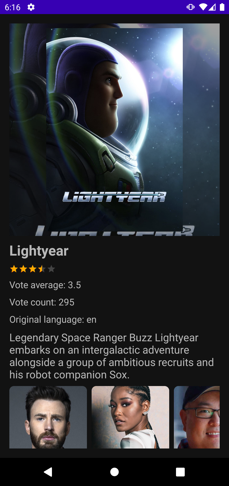
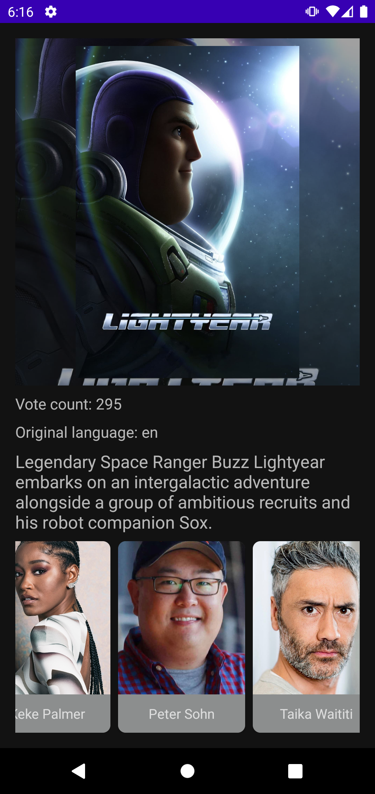
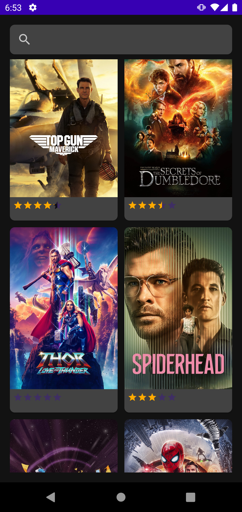
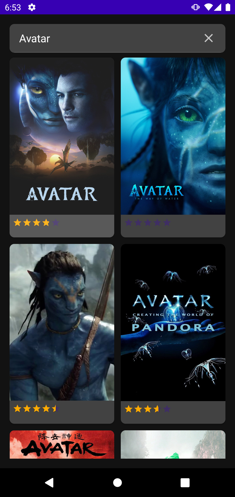

## Приложение для просмотра информации по фильмам
 > API-ключ необходимо добавить в local.properties (API_KEY=xxxxx)

### Что есть в приложении
* Реализовал отображение списка фильмов, с поддержкой пагинации и debouncing для поиска.
* При тапе на элемент списка отображаться экран с описанием выбранного фильма, рейтинг фильма, список актеров и их фото.
* Добавлены Unit-тесты

       
