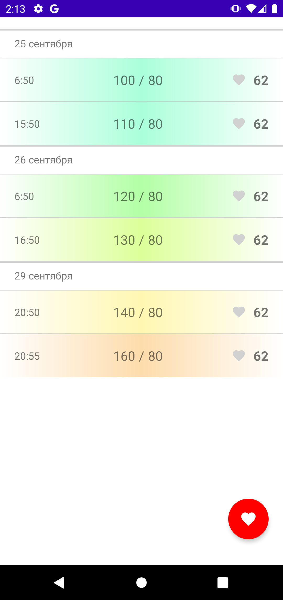
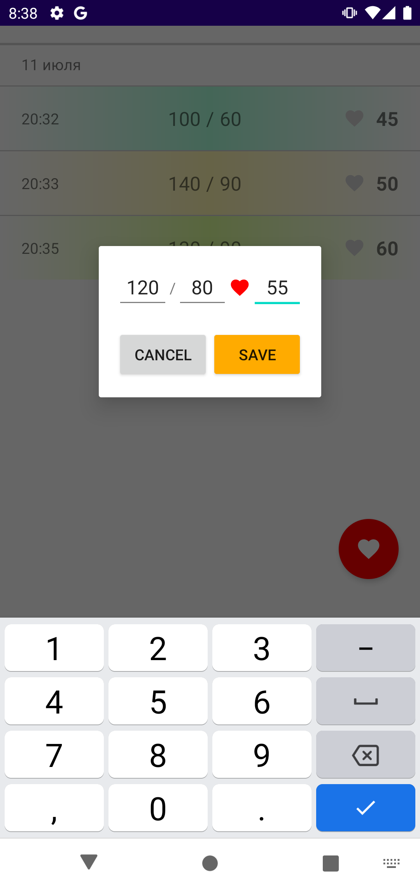
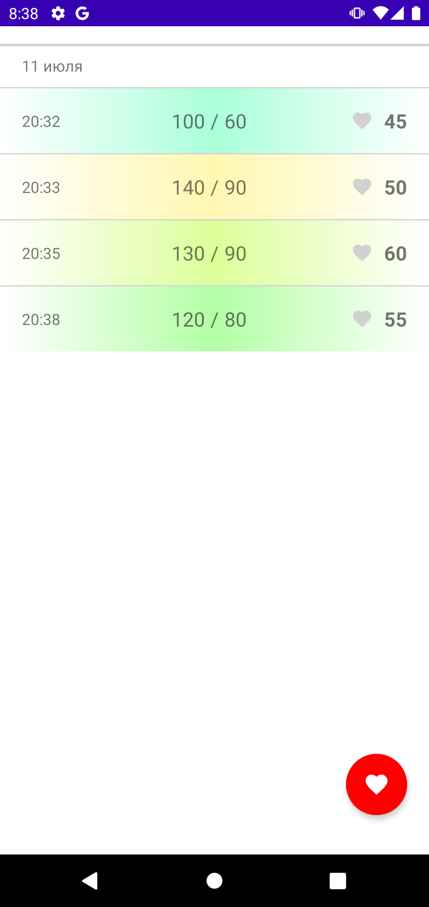

## Приложение для контроля давления и пульса (реализация Firestore)

### Что есть в приложении
* По нажатию на FAB вводятся данные по давлению и пульсу
* По длительному нажатию на элемент в списке, запись удаляется
* Разделение по дням и часам
* Данные хранятся только в Firestore

    
