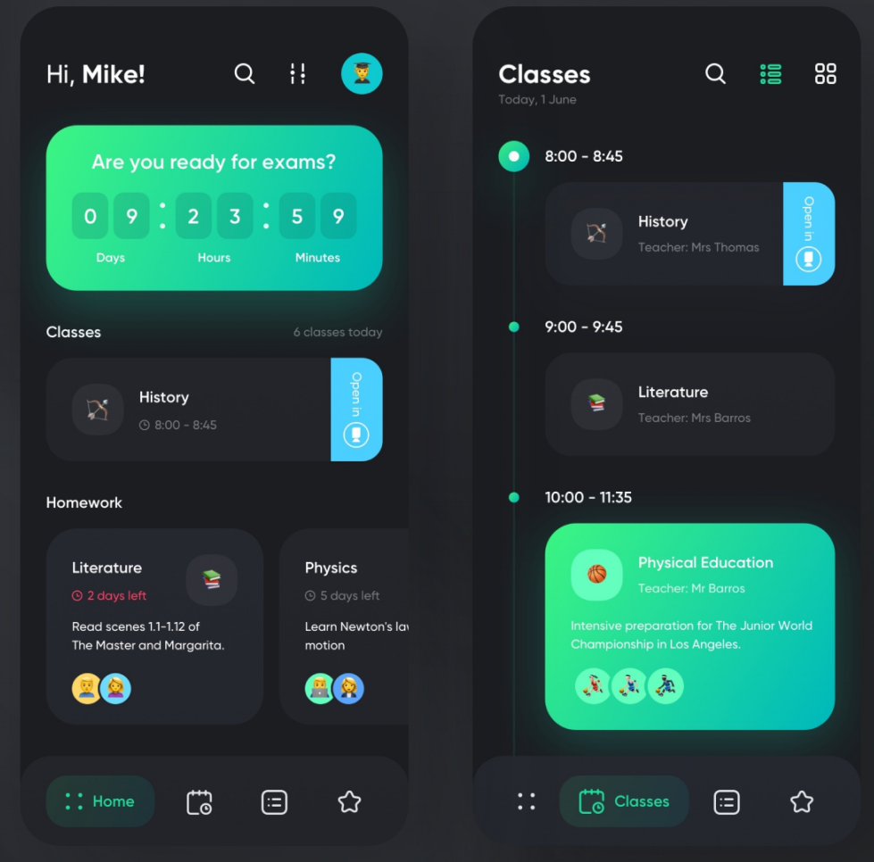
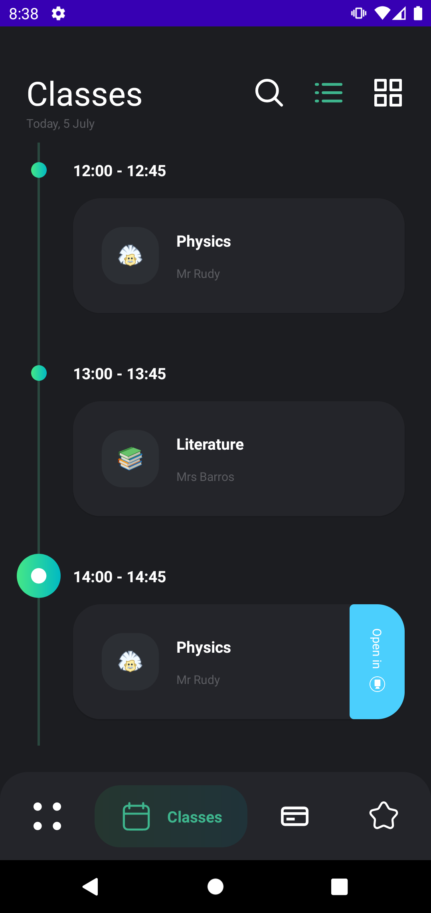

## Верстка XML (копирование экрана по картинке)

### Что должно быть:

  

### Что сделано:
* Загрузка значений времени до следующего экзамена
* Отображение списка с уроками на сегодня и ДЗ с дедлайнами + скролл до ближайшего урока
* Второй экран со списком уроков + скролл до ближайшего урока

  