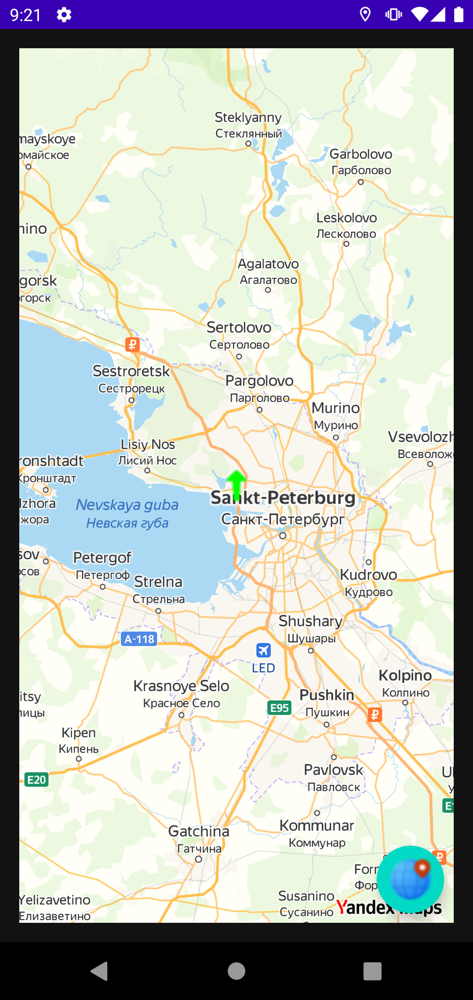
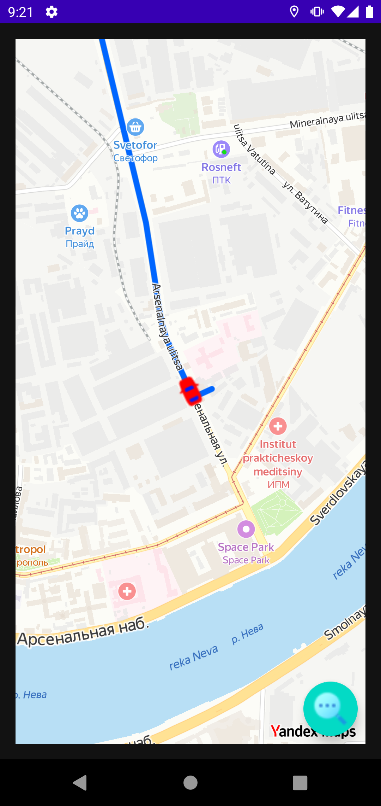
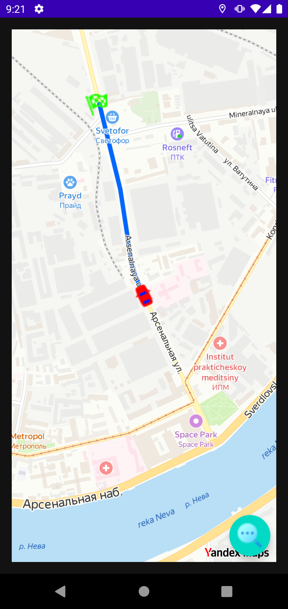
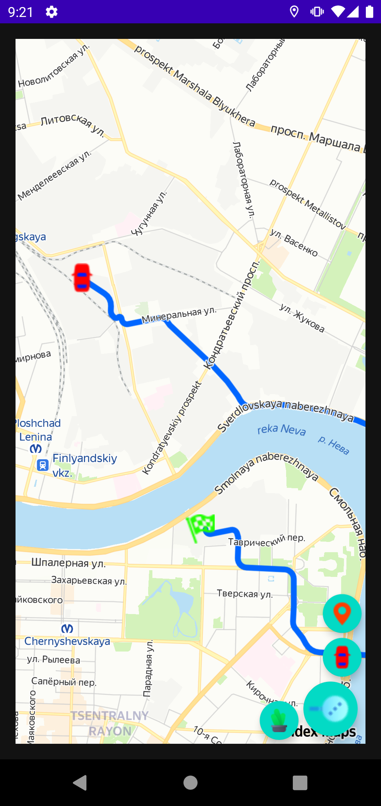

## Приложение с map kit
 > API-ключ необходимо добавить в local.properties (MAPS_API_KEY=xxxxx)

### Сценарий
Как задать маршрут:
1. Первый длинный тап по карте - начальная точка (машинка)
2. Второй длинный тап по карте – конечная точка (флажок)
3. Третий длинный тап сбрасывает все и ставить точку старта

Можно задать маршрут через всю карту, для этого необходимо нажать на машинку на выпадающей кнопке в правом нижнем углу.

Когда маршрут задан кликай по машинке и она поедет

       
