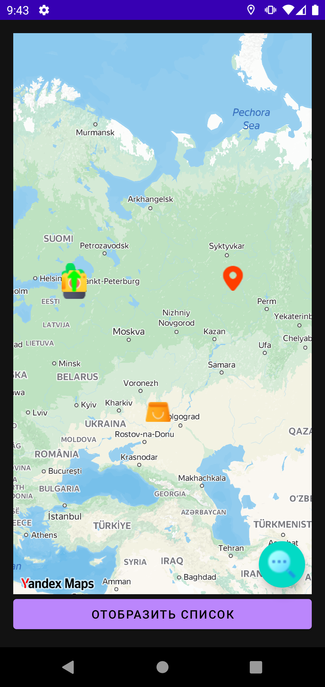
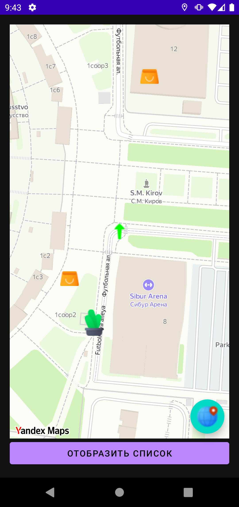
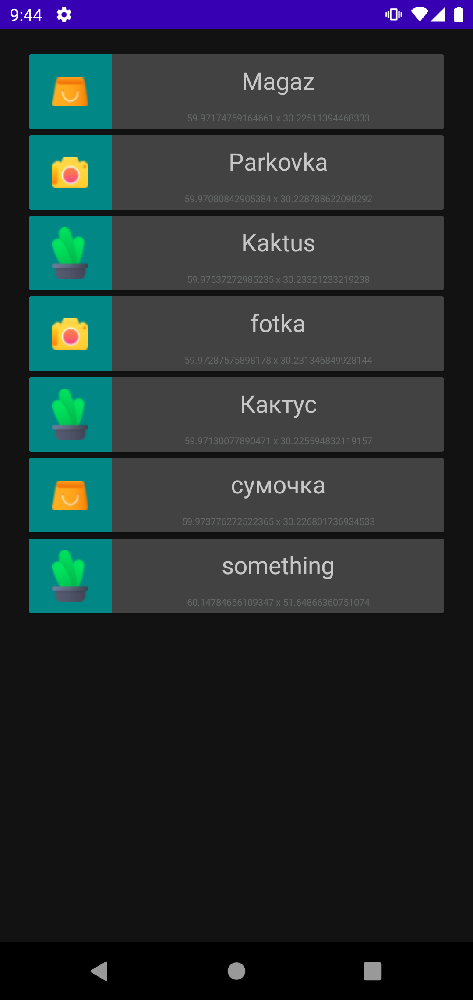
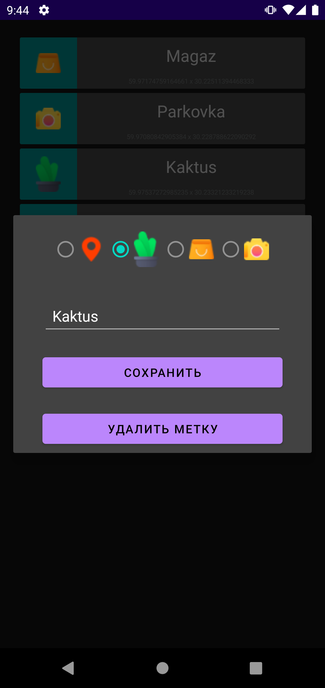

## Приложение с map kit
 > API-ключ необходимо добавить в local.properties (MAPS_API_KEY=xxxxx)

### Сценарий
* Находим устройство по геолокации. 
* Переходим к своей метке нажав на круглую кнопку 
* При долгом нажатии на карте открывается диалоговое окно для регистрации маркера
* Нажав на кнопку снизу, переходим к списку маркеров
* При коротком нажатии маркера переключаемся на карту и переходим к месту с маркером
* При долгом нажатии на маркер, появляется возможность редактирования и удаления

       
